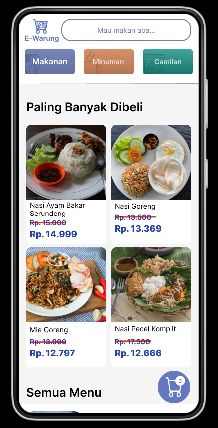
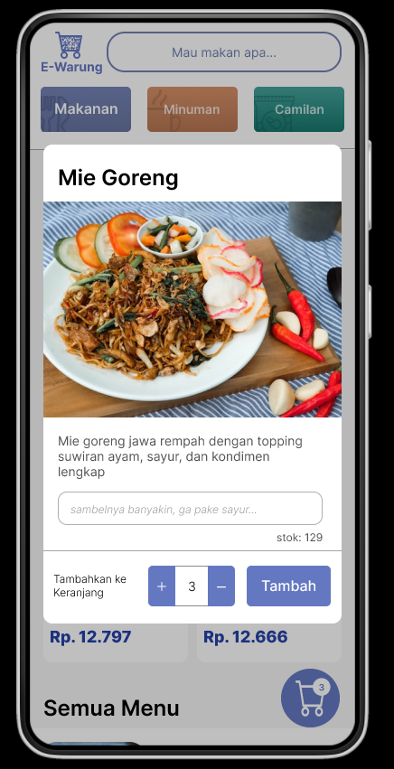
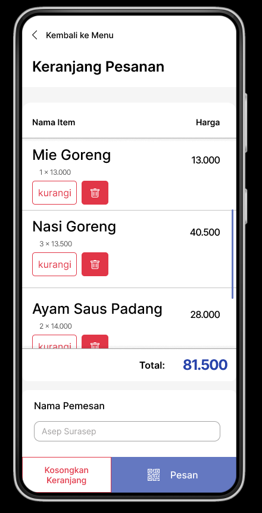

# e-warung-vue
Project Advanced Front End, Bootcamp Sinergi Peta

Link figma [here](https://www.figma.com/file/PjW1KRml7MBXvKonq9PTG4/E-Warung?node-id=0%3A1&t=OMrWrjlXUMOLSXlG-1)   

Link Prototype [here](https://www.figma.com/proto/PjW1KRml7MBXvKonq9PTG4/E-Warung?page-id=0%3A1&node-id=1%3A2&viewport=784%2C382%2C0.52&scaling=scale-down&starting-point-node-id=1%3A2&show-proto-sidebar=1)


## Mocking API

### Get List Menu

http request `GET ../api/listmenu?category={category}`, could `food`, `snack`, or `drink`

```js
foods = { 
  items: [
      productItem,
      productItem,
      productItem,
      ....
  ],
  total: 10,
}
```

for `productItem`

```js
productItem = {
    id: "f-01", // f - food, s - snack, d - drink
    name: "Mie Goreng",
    price: 12500,
    discount: 0.05, // or 0 for not available
    desc: "Mie goreng jawa rempah dengan topping suwiran ayam, sayur, dan kondimen lengkap",
    img: "https://...",
    custom: {
        requestPh: "sambelnya banyakin, ga pake sayur...",      // or just ""
    },
    stock: 15,
}
```

### Post Order

http reqeust `POST .../api/order`

```js
order = {
  id: "2023$02$18-@012",
  createdAt: "2023-02-18T02:07:28.475Z",
  name: "Asep Surasep",
  carts: [
    cartItem,
    cartItem,
    cartItem,
  ],
  total: 81500
}
```

for `cartItem`

```js
cartItem = {
  productId: "f-01",
  qty: 2,
  price: 12500,
  total: 25000,
  custom: {
    request: "sambelnya banyakin, ga pake sayur..",
  },
}
```

## Note

`order` genereated when user click "Pesan". The `id` property of `order` is the content of generated qrcode displayed to user.


## Preview Mobile 



  


  


